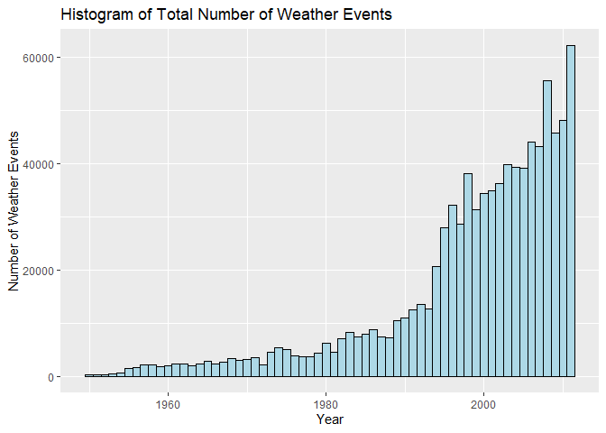
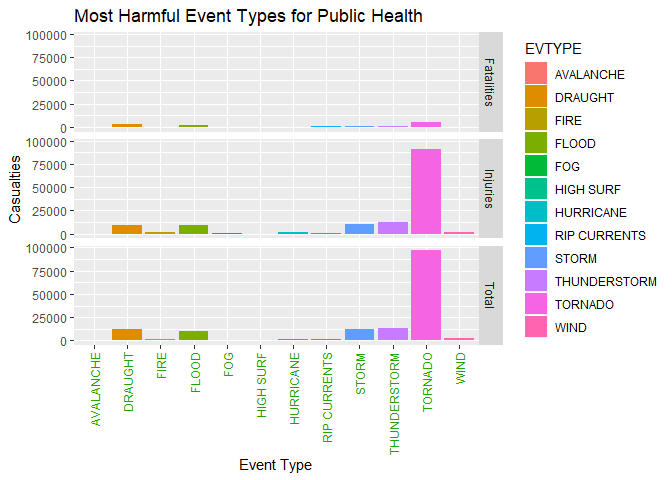
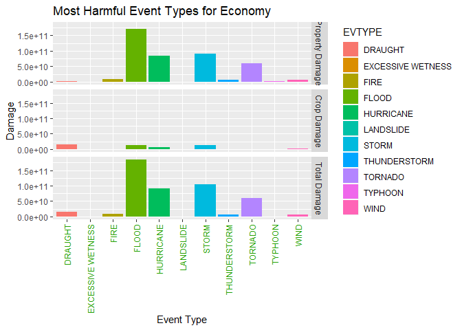

## Synopsis : 

Storms and other severe weather events can cause both public health and economic problems for communities and municipalities. Many severe events can result in fatalities, injuries, and property damage, and preventing such outcomes to the extent possible is a key concern.
In this report, our objective is to analyze the US National Weather Service Storm Data, and use the estimates of fatalities, injuries, and property damage to answer the following questions

1. Across the United States, which types of events (as indicated in the __EVTYPE__ variable) are most harmful with respect to population health?

2. Across the United States, which types of events have the greatest economic consequences?
From the analysis, it was found that __TORNADO__ is most harmful event type for Public Health and __FLOOD__ has the greatest economic consequences.

## About the data :

The data used for this assignment is the __US National Weather Service Storm Data__ .
The dataset comes in the form of a comma-separated-value file compressed via the bzip2 algorithm to reduce its size. We can download the file from:

- [Storm Data](https://d396qusza40orc.cloudfront.net/repdata%2Fdata%2FStormData.csv.bz2)

There is also some documentation of the database available. Here we can find how some of the variables are constructed/defined.

- [National Weather Service Storm Data Documentation](https://d396qusza40orc.cloudfront.net/repdata%2Fpeer2_doc%2Fpd01016005curr.pdf)

- National Climatic Data Center Storm Events [FAQ](https://d396qusza40orc.cloudfront.net/repdata%2Fpeer2_doc%2FNCDC%20Storm%20Events-FAQ%20Page.pdf)

The events in the database start in the year 1950 and end in November 2011. 

### Setting Global Option :

Setting echo=TRUE globally, so that all my code chunks used for the analysis is present in the final report.


```r
knitr::opts_chunk$set(echo = TRUE)
```

Loading required libraries for the analysis


```r
library(R.utils)
library(data.table)
library(ggplot2)
```

## Data Processing:

### Downloading and Reading the Data :

1. Checking if **StormData.csv.bz2** file is already present, and if not then downloading the data


```r
if(!file.exists("StormData.csv.bz2")){
  download.file(url = "https://d396qusza40orc.cloudfront.net/repdata%2Fdata%2FStormData.csv.bz2",
                destfile = "./StormData.csv.bz2")
}
```

2. Checking if the dataset is already unzipped, and if not then unzipping the data.


```r
filename <- "StormData.csv.bz2"
destfile <- "StormData.csv"
if(!file.exists("StormData.csv")){
  bunzip2(filename,destfile,overwrite=TRUE,remove=FALSE)
}
```

3. Reading the __StormData.csv__ file into a data.table-dataframe

R will take some time reading the data for the first time as the data is of 535MB (approx.). So, we will use __cache=TRUE__ for this code chunk, to save some time when we run the document next time.


```r
storm <- data.table(read.csv(file="StormData.csv",header=TRUE,stringsAsFactors = FALSE))
```

4. Viewing the first 3 rows of the Storm Data 

```r
head(storm,n=3)
```

```
##    STATE__          BGN_DATE BGN_TIME TIME_ZONE COUNTY COUNTYNAME STATE  EVTYPE
## 1:       1 4/18/1950 0:00:00     0130       CST     97     MOBILE    AL TORNADO
## 2:       1 4/18/1950 0:00:00     0145       CST      3    BALDWIN    AL TORNADO
## 3:       1 2/20/1951 0:00:00     1600       CST     57    FAYETTE    AL TORNADO
##    BGN_RANGE BGN_AZI BGN_LOCATI END_DATE END_TIME COUNTY_END COUNTYENDN
## 1:         0                                               0         NA
## 2:         0                                               0         NA
## 3:         0                                               0         NA
##    END_RANGE END_AZI END_LOCATI LENGTH WIDTH F MAG FATALITIES INJURIES PROPDMG
## 1:         0                      14.0   100 3   0          0       15    25.0
## 2:         0                       2.0   150 2   0          0        0     2.5
## 3:         0                       0.1   123 2   0          0        2    25.0
##    PROPDMGEXP CROPDMG CROPDMGEXP WFO STATEOFFIC ZONENAMES LATITUDE LONGITUDE
## 1:          K       0                                         3040      8812
## 2:          K       0                                         3042      8755
## 3:          K       0                                         3340      8742
##    LATITUDE_E LONGITUDE_ REMARKS REFNUM
## 1:       3051       8806              1
## 2:          0          0              2
## 3:          0          0              3
```

5. Viewing the names of the columns of the Storm Data

```r
names(storm)
```

```
##  [1] "STATE__"    "BGN_DATE"   "BGN_TIME"   "TIME_ZONE"  "COUNTY"    
##  [6] "COUNTYNAME" "STATE"      "EVTYPE"     "BGN_RANGE"  "BGN_AZI"   
## [11] "BGN_LOCATI" "END_DATE"   "END_TIME"   "COUNTY_END" "COUNTYENDN"
## [16] "END_RANGE"  "END_AZI"    "END_LOCATI" "LENGTH"     "WIDTH"     
## [21] "F"          "MAG"        "FATALITIES" "INJURIES"   "PROPDMG"   
## [26] "PROPDMGEXP" "CROPDMG"    "CROPDMGEXP" "WFO"        "STATEOFFIC"
## [31] "ZONENAMES"  "LATITUDE"   "LONGITUDE"  "LATITUDE_E" "LONGITUDE_"
## [36] "REMARKS"    "REFNUM"
```

### Processing the Data:

In this section, we preprocess the data according to our need and prepare a new dataset using which we are to answer the questions in the assignment.

All the columns of the __storm__ dataframe is not needed to achieve our objective. So, we now extract the required columns and store it in a new dataframe called __"analysisData"__

1. Creating the new dataframe __"analysisData"__ by extracting the required columns from storm dataset

```r
analysisData <- storm[,c("BGN_DATE","EVTYPE","FATALITIES","INJURIES","PROPDMG","PROPDMGEXP",
                         "CROPDMG","CROPDMGEXP")]
```

2. Changing the BGN_DATE column(character) into class date using as.Date and storing only the year in a new column (YEAR)


```r
analysisData$BGN_DATE <- as.Date(analysisData$BGN_DATE,format="%m/%d/%Y %H:%M:%S")
analysisData$YEAR <- as.numeric(format(analysisData$BGN_DATE,"%Y"))  
```

3. It can be seen that the units of the economic damage related to property damage and crop damage are stored in the PROPDMGEXP and CROPDMGEXP columns respectively, which is to be interpreted as follows -
- h and H = hundreds (100)
- k and K = thousands (1000)
- m and M = millions (1e+06)
- b and B = billions (1e+09)
- others = zero (0)

So, according to this interpretation, we calculate the actual property damage and crop damage done by the various events and store them into two new columns named __"PropertyDamage" and "CropDamage"__ respectively.


```r
analysisData[is.na(analysisData)] <- 0
analysisData[, `:=`("PropertyDamage", if (PROPDMGEXP %in% c("K", "k")) PROPDMG * 1000 
           else if (PROPDMGEXP %in% c("M", "m")) PROPDMG * 1e+06 
           else if (PROPDMGEXP %in% c("B","b")) PROPDMG * 1e+09 
           else if (PROPDMGEXP %in% c("H","h")) PROPDMG * 100
           else 0), by = 1:nrow(analysisData)]
analysisData[, `:=`("CropDamage", if (CROPDMGEXP %in% c("K", "k")) CROPDMG * 1000 
                    else if (CROPDMGEXP %in% c("M", "m")) CROPDMG * 1e+06 
                    else if (CROPDMGEXP %in% c("B","b")) CROPDMG * 1e+09 
                    else if (CROPDMGEXP %in% c("H","h")) CROPDMG * 100
                    else 0), by = 1:nrow(analysisData)]
```

4. Now, to get an idea about the complete impact of severe weather events on population health and economy, we create two new columns namely __"TotalDamage"__ (adding PropertyDamage and CropDamage) and __"HealthImpact"__ (adding FATALITIES and INJURIES).

```r
analysisData[,`:=`("TotalDamage", get("PropertyDamage") + get("CropDamage")),by=1:nrow(analysisData)]
analysisData[,`:=`("HealthImpact",get("FATALITIES")+get("INJURIES")),by=1:nrow(analysisData)]
```

5. We now create a final dataset for our analysis containing only the columns related to event type, health impact and economic impact.

```r
finaldata <- analysisData[,c("EVTYPE","FATALITIES","INJURIES","PropertyDamage","CropDamage","TotalDamage","HealthImpact")]
```

6. There are few Event types which though have different labels but can be grouped under a single category. For example - 

- TSTM WIND, THUNDERSTORM WINDS and Lightning can be grouped into a single category of THUNDERSTORMS.  
- Similarly, HURRICANE and HURRICANE/TYPHOON can be grouped into HURRICANE.

We now group the similar event types into a single category and transform out dataset


```r
finaldata$EVTYPE[grep("heat|drought|dry",finaldata$EVTYPE, ignore.case = T)] <- "DRAUGHT"
finaldata$EVTYPE[grep("tornado|tornadoes",finaldata$EVTYPE, ignore.case = T)] <- "TORNADO"
finaldata$EVTYPE[grep("flood|fld|rain",finaldata$EVTYPE, ignore.case = T)] <- "FLOOD"
finaldata$EVTYPE[grep("storm|blizzard|hail|cold|snow|frost|freeze",finaldata$EVTYPE,ignore.case = T)] <- "STORM"
finaldata$EVTYPE[grep("tstm|thunderstorm|lightning",finaldata$EVTYPE, ignore.case = T)]<-"THUNDERSTORM"
finaldata$EVTYPE[grep("rip",finaldata$EVTYPE, ignore.case = T)] <- "RIP CURRENTS"
finaldata$EVTYPE[grep("fire|wildfire",finaldata$EVTYPE, ignore.case = T)] <- "FIRE"
finaldata$EVTYPE[grep("wind",finaldata$EVTYPE, ignore.case = T)] <- "WIND"
finaldata$EVTYPE[grep("hurricane",finaldata$EVTYPE, ignore.case = T)] <- "HURRICANE"
```

## Results :

### Histogram of the Total Weather Events in a year from 1950-2011

```r
ggplot(analysisData,aes(x=YEAR))+geom_histogram(binwidth = 1,fill="lightblue",color="black")+
  ggtitle("Histogram of Total Number of Weather Events")+
  labs(x="Year",y="Number of Weather Events")
```

<!-- -->

From the histogram, it can be seen that from the year 1994 there is a considerable increase in the number of weather events in US. This is due to lack of good records for the earlier years as not all events were recorded during that time and with time the records are being created and maintained much more effectively.

### QUESTION 1 : Across the United States, which types of events (as indicated in the EVTYPE variable) are most harmful with respect to population health?

We use the prepared __finaldata__ dataset to answer this question and the analysis for this is shown below alongwith the respective plot for better understanding.
  
First we find the sum of fatalities, injuries, and total health impact corresponding to different Event types and then order them in decreasing order to find the most harmful event type with respect to public health.
  

```r
Fatalities <- with(finaldata,aggregate(FATALITIES~EVTYPE,FUN=sum))
Injuries <- with(finaldata,aggregate(INJURIES~EVTYPE,FUN=sum))
Health <- with(finaldata,aggregate(HealthImpact~EVTYPE,FUN=sum))
FatalitiesOrder <- Fatalities[order(Fatalities$FATALITIES,decreasing = T),]
InjuriesOrder <- Injuries[order(Injuries$INJURIES,decreasing = T),]
HealthOrder <- Health[order(Health$HealthImpact,decreasing = T),]
```

Let us now have a look and the top 10 event types impacting population health 

- __Top 10 Fatalities Events__


```r
Top10Fatalities <- FatalitiesOrder[1:10,]
Top10Fatalities
```

```
##           EVTYPE FATALITIES
## 242      TORNADO       5661
## 29       DRAUGHT       3170
## 42         FLOOD       1666
## 173        STORM       1356
## 241 THUNDERSTORM       1331
## 158 RIP CURRENTS        577
## 286         WIND        469
## 10     AVALANCHE        224
## 89     HURRICANE        133
## 78     HIGH SURF        101
```

__TORNADO__ is the event type which has caused highet number of Fatalities in US. This is followed by DRAUGHT and STORM in 2nd and 3rd place.

- __Top 10 Injuries Events__


```r
Top10Injuries <- InjuriesOrder[1:10,]
Top10Injuries
```

```
##           EVTYPE INJURIES
## 242      TORNADO    91407
## 241 THUNDERSTORM    12201
## 173        STORM    10448
## 29       DRAUGHT     9257
## 42         FLOOD     8988
## 286         WIND     1895
## 40          FIRE     1608
## 89     HURRICANE     1328
## 43           FOG      734
## 158 RIP CURRENTS      529
```

__TORNADO__ is again the most harmful event in terms of number of injuries in US, with STORM and DRAUGHT being second and third most harmful in terms of injuries.

- __Plot for Most Harmful Event Type with respect to Population Health__


```r
Top10Fatalities <- cbind(Top10Fatalities,rep("Fatalities",10))
names(Top10Fatalities)<-c("EVTYPE","Casualties","Type")
Top10Injuries <- cbind(Top10Injuries,rep("Injuries",10))
names(Top10Injuries)<-c("EVTYPE","Casualties","Type")
Top10Health <- HealthOrder[1:10,]
Top10Health <- cbind(Top10Health,rep("Total",10))
names(Top10Health)<-c("EVTYPE","Casualties","Type")
HealthImpact<- rbind(Top10Fatalities,Top10Injuries,Top10Health)
ggplot(HealthImpact,aes(x=EVTYPE,y=Casualties,fill=EVTYPE))+geom_bar(stat="identity")+
  facet_grid(Type~.)+theme(axis.text.x = element_text(color="#25A203",angle = 90,hjust = 1,vjust = 0.5))+labs(title="Most Harmful Event Types for Public Health",x="Event Type",y="Casualties")
```

<!-- -->

From the plot, it can be clearly seen that __TORNADO is the most harmful Event Type with respect to Population Health__ and results in highest number of casualties (both fatalities and injuries).

### QUESTION 2 : Across the United States, which types of events have the greatest economic consequences?

We use the prepared __finaldata__ dataset to answer this question and the analysis for this is shown below alongwith the respective plot for better understanding.

First we find the sum of damage done to property, crop, and total economic damage corresponding to different Event types and then order them in decreasing order to find the most harmful event type with respect to Economic consequences.
  

```r
Property <- with(finaldata,aggregate(PropertyDamage~EVTYPE,FUN=sum))
Crop <- with(finaldata,aggregate(CropDamage~EVTYPE,FUN=sum))
Total <- with(finaldata,aggregate(TotalDamage~EVTYPE,FUN=sum))
PropertyOrder <- Property[order(Property$PropertyDamage,decreasing = T),]
CropOrder <- Crop[order(Crop$CropDamage,decreasing = T),]
TotalOrder <- Total[order(Total$TotalDamage,decreasing = T),]
```

Let us now have a look and the top 10 event types according to property damage

- __Top 10 Events for Damage to Property__


```r
Top10Property <- PropertyOrder[1:10,]
Top10Property
```

```
##           EVTYPE PropertyDamage
## 42         FLOOD   170842808160
## 173        STORM    90773496210
## 89     HURRICANE    84656180010
## 242      TORNADO    58593097730
## 40          FIRE     8496628500
## 286         WIND     6176978990
## 241 THUNDERSTORM     5432882220
## 29       DRAUGHT     1073164350
## 246      TYPHOON      600230000
## 103    LANDSLIDE      324596000
```

__FLOOD__ is the type of weather event which has caused highest amount of damage to properties in US.

- __Top 10 Events for Damage to Crops__


```r
Top10Crop <- CropOrder[1:10,]
Top10Crop
```

```
##                EVTYPE  CropDamage
## 29            DRAUGHT 14877050280
## 42              FLOOD 13194760000
## 173             STORM 13179022250
## 89          HURRICANE  5505292800
## 286              WIND   777315400
## 241      THUNDERSTORM   566099440
## 242           TORNADO   417461360
## 40               FIRE   403281630
## 38  EXCESSIVE WETNESS   142000000
## 103         LANDSLIDE    20017000
```

__DRAUGHT__ is the most harmful event type when it comes to causing highest damage to crops in US.

- __Plot for Most Harmful Event Type with respect to Economic Consequences__


```r
Top10Property <- cbind(Top10Property,rep("Property Damage",10))
names(Top10Property) <- c("EVTYPE","Damage","Type")
Top10Crop <- cbind(Top10Crop,rep("Crop Damage",10))
names(Top10Crop) <- c("EVTYPE","Damage","Type")
Top10Economy <- TotalOrder[1:10,]
Top10Economy <- cbind(Top10Economy,rep("Total Damage",10))
names(Top10Economy) <- c("EVTYPE","Damage","Type")
EconomyEffect <- rbind(Top10Property,Top10Crop,Top10Economy)
ggplot(EconomyEffect,aes(x=EVTYPE,y=Damage,fill=EVTYPE))+geom_bar(stat="identity")+
  facet_grid(Type~.)+theme(axis.text.x = element_text(color="#25A203",angle = 90,hjust = 1,vjust = 0.5))+labs(title="Most Harmful Event Types for Economy",x="Event Type",y="Damage")
```

<!-- -->

From the plot, it is clear that __FLOOD__ is the event type with greatest economic consequences. This is followed by STORM in second and HURRICANE in third place respectively.

## Conclusion :

From the above analysis, we can conclude that - 

1. __TORNADO__ is the deadliest weather event for Public Health, both in terms of fatalities (5,661) and injuries (91,407).

2. When it comes to greatest economic consequences, then -
  - **FLOOD** brings highest damage to properties whereas __DRAUGHT__ causes highest damage to crops.
  - **FLOOD** hurts economy the most when compared to other severe whether events.
